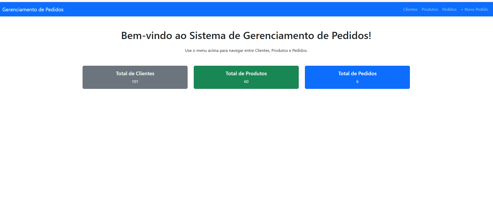
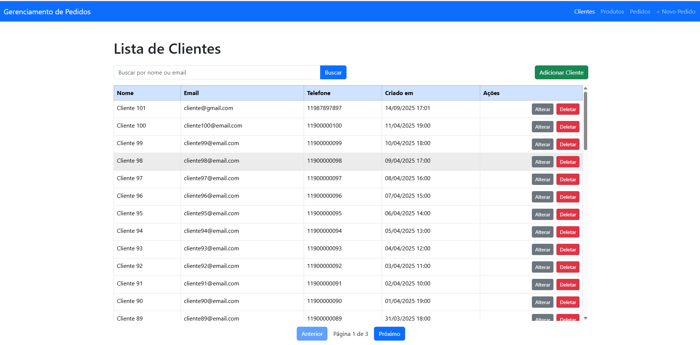
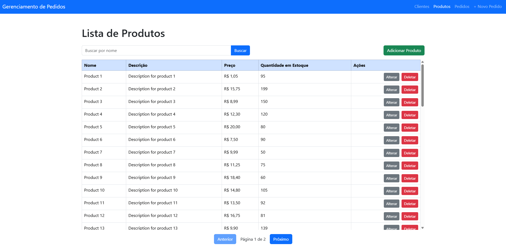
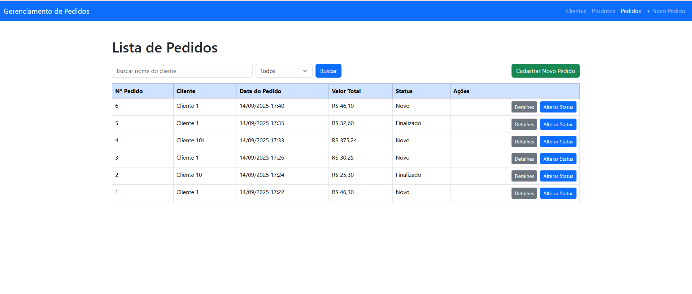
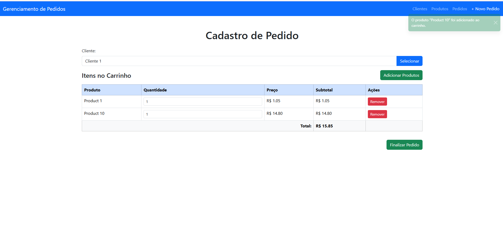
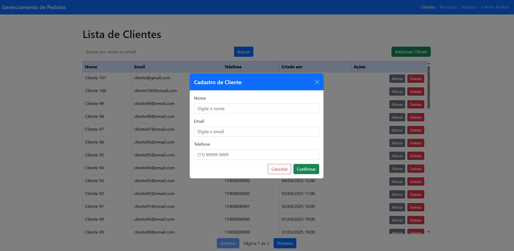
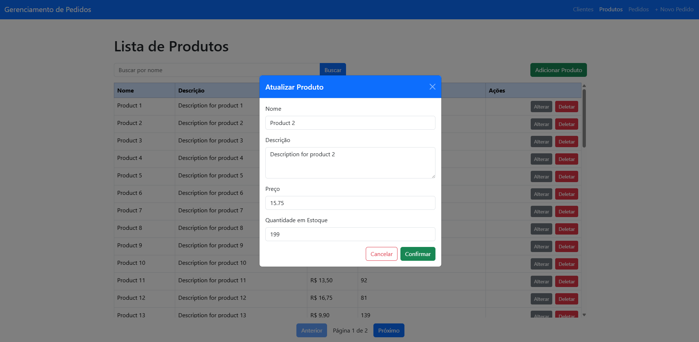
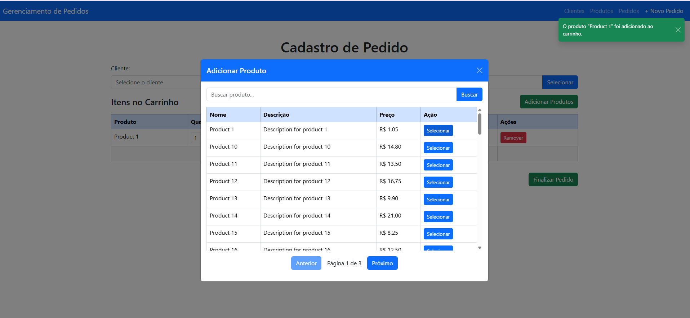

<h1>Gerenciamento de Pedidos - Back-End</h1>

Back-end do sistema de <strong>Gerenciamento de Pedidos</strong>, desenvolvido para pequenas lojas, utilizando <strong>C# e ASP.NET Core MVC</strong>. 
Permite gerenciar clientes, produtos e pedidos, com acesso a dados via <strong>Dapper.NET</strong> e banco de dados <strong>SQL Server</strong>.

<h2>Tecnologias Utilizadas</h2>
<ul>
  <li><strong>C# / ASP.NET Core MVC</strong> – desenvolvimento do back-end.</li>
  <li><strong>SQL Server</strong> – banco de dados relacional.</li>
  <li><strong>Dapper.NET</strong> – ORM leve para acesso a dados.</li>
  <li><strong>Injeção de Dependência</strong> nativa do ASP.NET Core.</li>
</ul>

<h2>Funcionalidades Principais</h2>

<h3>1. Gerenciamento de Clientes</h3>
<ul>
  <li>CRUD completo: cadastro, edição, listagem e exclusão.</li>
  <li>Campos da tabela <strong>client</strong>:
    <ul>
      <li><strong>id</strong> – Identificador único do cliente.</li>
      <li><strong>name</strong> – Nome do cliente.</li>
      <li><strong>email</strong> – Email do cliente.</li>
      <li><strong>phone</strong> – Telefone do cliente.</li>
      <li><strong>created_at</strong> – Data e hora de criação do registro.</li>
    </ul>
  </li>
  <li>Endpoint para listar clientes com filtros por <strong>name</strong> ou <strong>email</strong>.</li>
</ul>

<h3>2. Gerenciamento de Produtos</h3>
<ul>
  <li>CRUD completo: cadastro, edição, listagem e exclusão.</li>
  <li>Campos da tabela <strong>product</strong>:
    <ul>
      <li><strong>id</strong> – Identificador único do produto.</li>
      <li><strong>name</strong> – Nome do produto.</li>
      <li><strong>description</strong> – Descrição do produto.</li>
      <li><strong>price</strong> – Preço do produto.</li>
      <li><strong>stock_quantity</strong> – Quantidade disponível em estoque.</li>
    </ul>
  </li>
  <li>Endpoint para listar produtos com filtro por <strong>name</strong>.</li>
  <li>Validação de campos antes de salvar.</li>
</ul>

<h3>3. Registro e Gerenciamento de Pedidos</h3>
<ul>
  <li>Campos da tabela <strong>order</strong>:
    <ul>
      <li><strong>id</strong> – Identificador único do pedido.</li>
      <li><strong>client_id</strong> – Referência ao cliente que realizou o pedido.</li>
      <li><strong>order_date</strong> – Data e hora da criação do pedido.</li>
      <li><strong>total_value</strong> – Valor total do pedido.</li>
      <li><strong>status_id</strong> – Referência ao status do pedido (<em>Novo</em>, <em>Processamento</em>, <em>Finalizado</em>).</li>
    </ul>
  </li>

  <li>Campos da tabela <strong>order_status</strong>:
    <ul>
      <li><strong>id</strong> – Identificador único do status.</li>
      <li><strong>description</strong> – Descrição do status (ex: Novo, Processamento, Finalizado).</li>
    </ul>
  </li>

  <li>Campos da tabela <strong>item_order</strong>:
    <ul>
      <li><strong>id</strong> – Identificador único do item do pedido.</li>
      <li><strong>order_id</strong> – Referência ao pedido.</li>
      <li><strong>product_id</strong> – Referência ao produto incluído no pedido.</li>
      <li><strong>quantity</strong> – Quantidade do produto.</li>
      <li><strong>unit_price</strong> – Preço unitário do produto no momento do pedido.</li>
    </ul>
  </li>

  <li>Criar pedidos associando <strong>Cliente</strong> e <strong>Produtos</strong>.</li>
  <li>Adicionar múltiplos produtos, informando a quantidade.</li>
  <li>Validação de <strong>estoque disponível</strong> antes de adicionar produtos.</li>
  <li>Cálculo automático do <strong>valor total</strong> do pedido.</li>
  <li>Alteração do <strong>status do pedido</strong> (ex: Novo → Processamento → Finalizado).</li>
  <li>Listagem de pedidos com filtros por <strong>name</strong> do cliente ou <strong>status</strong>.</li>
  <li>Visualização detalhada de cada pedido, incluindo produtos, quantidades e preços unitários.</li>
</ul>

<h3>4. Notificações</h3>
<ul>
  <li>Campos da tabela <strong>notification</strong>:
    <ul>
      <li><strong>id</strong> – Identificador único da notificação.</li>
      <li><strong>order_id</strong> – Referência ao pedido associado.</li>
      <li><strong>message</strong> – Mensagem da notificação.</li>
      <li><strong>created_at</strong> – Data e hora de criação da notificação.</li>
    </ul>
  </li>
  <li>O sistema mantém um registro de notificações relacionadas a pedidos, sempre que seus status são alterados.</li>
</ul>

<h3>5. Estrutura e Boas Práticas</h3>
<ul>
  <li>Arquitetura organizada em camadas: <strong>Apresentação</strong>, <strong>Negócio/Domínio</strong>, <strong>Infraestrutura/Dados</strong>.</li>
  <li>Padrão Repository para abstração do acesso a dados via Dapper.NET.</li>
  <li>Princípios de <strong>Orientação a Objetos (SOLID)</strong> aplicados.</li>
  <li>Tratamento de exceções e validações básicas implementadas.</li>
</ul>

<h3>6. Testes Unitários</h3>

O projeto inclui testes unitários para demonstrar qualidade de código e boas práticas.

<ul>
  <li>Testes localizados na pasta <strong>Tests</strong> do projeto.</li>
  <li>Framework de testes: <strong>xUnit</strong>.</li>
  <li>Uso do <strong>Moq</strong> para simular dependências.</li>
  <li>Exemplos de testes:
    <ul>
      <li>Excluir cliente que não possui pedidos.</li>
      <li>Tentar alterar status de pedido inexistente (lançando <code>BadRequestException</code>).</li>
      <li>Excluir produto com ou sem pedidos associados, verificando retorno ou exceção.</li>
    </ul>
  </li>
</ul>

<h2>Integração com Front-End</h2>

O back-end é consumido pelo front-end do projeto, que realiza todas as operações de CRUD via <strong>HTTP usando Axios</strong>. 
Repositório front-end: <a href="https://github.com/DiogoLuiss/order-management-web">Order Management</a>

<h2>Como Executar</h2>
<ol>
  <li>
    Clone o repositório: 
    <pre><code>git clone https://github.com/DiogoLuiss/order-management-api.git</code></pre>
  </li>
  <li>
    Configure os arquivos de configuração do projeto:
    <ul>
      <li><strong>appsettings.json</strong> – para ambiente de <strong>produção</strong>.</li>
      <li><strong>appsettings.Development.json</strong> – para ambiente de <strong>desenvolvimento/debug</strong>.</li>
    </ul>
    Ambos os arquivos devem conter a string de conexão com o banco de dados SQL Server:
    <pre><code>{
  "ConnectionStrings": {
    "DefaultConnection": "Data Source=(localdb)\\MSSQLLocalDB;Initial Catalog=order_management;User ID=SEU_USUARIO;Password=SUA_SENHA;Persist Security Info=True;Pooling=False;MultipleActiveResultSets=False;Encrypt=True;TrustServerCertificate=False;Application Name=SQLServerManagementStudio;Command Timeout=30"
  }
}</code></pre>
  </li>
  <li>Execute os scripts SQL disponíveis na pasta <strong>Scripts</strong> para criar tabelas e inserir dados iniciais.</li>
  <li>Em seguida, verifique a URL em que a API está sendo executada e configure-a no front-end, no arquivo <code>src/js/services/api.js</code>.</li>
</ol>
<h2>Demonstração</h2>

[Veja a demo do sistema](./assets/demo.mp4)

  
  
  
  
  
  
  
  

